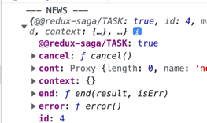
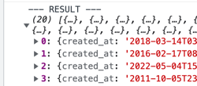

## 2. Установка и настройка окружения (Setup Environment)

```d
npm i redux react-redux redux-saga
```

_webdev-redux-saga/src/redux/store.js_
```js
import {createStore, compose} from "redux";
import reducer from "./reducers";

const composeEnhancers =
  typeof window === 'object' &&
  window.__REDUX_DEVTOOLS_EXTENSION_COMPOSE__ ?
    window.__REDUX_DEVTOOLS_EXTENSION_COMPOSE__({}) : compose;

const configureStore = preloadedState => createStore(
  reducer,
  preloadedState,
  composeEnhancers()
)

const store = configureStore({});

export default store;
```
_webdev-redux-saga/src/redux/reducers/index.js_
```js
import {combineReducers} from "redux";

const test = (state = {}, action) => {
  return state;
}

const reducer = combineReducers(({
  test
}))

export default reducer;
```

## 3. Интеграция Redux (Redux Integration)

_webdev-redux-saga/src/redux/constants.js_
```js
export const INCREASE_COUNT = 'INCREASE_COUNT';
export const DECREASE_COUNT = 'DECREASE_COUNT';
```

_webdev-redux-saga/src/redux/actions/actionCreators.js_
```js
import {DECREASE_COUNT, INCREASE_COUNT} from "../constants";

export const increaseCount = () => ({
  type: INCREASE_COUNT
})

export const decreaseCount = () => ({
  type: DECREASE_COUNT
})
```
_webdev-redux-saga/src/redux/reducers/counter.js_
```js
import {DECREASE_COUNT, INCREASE_COUNT} from "../constants";

export const counter = (state = {count: 0}, {type}) => {
  switch(type) {
    case INCREASE_COUNT:
      return {
        ...state,
        count: state.count + 1
      }
    case DECREASE_COUNT:
      return {
        ...state,
        count: state.count - 1
      }
    default:
      return state
  }
}
```

_webdev-redux-saga/src/redux/reducers/index.js_
```js
import {combineReducers} from "redux";
import {counter} from "./counter";

const reducer = combineReducers({
  counter
})

export default reducer;
```
_webdev-redux-saga/src/App.js_
```js
import logo from './logo.svg';
import './App.css';
import {useDispatch, useSelector} from "react-redux";
import {decreaseCount, increaseCount} from "./redux/actions/actionCreators";

function App() {
  const dispatch = useDispatch();
  const count = useSelector(state => state?.counter?.count)

  const handleIncrease = () => {
    dispatch(increaseCount())
  }

  const handleDecrease = () => {
    dispatch(decreaseCount())
  }

  return (
    <div>
      <button onClick={handleDecrease}>-1</button>
      <span>{count}</span>
      <button onClick={handleIncrease}>+1</button>
    </div>
  );
}

export default App;
```

## 4. Интеграция Redux-Saga (Redux-Saga Integration)

NOTE:  

_webdev-redux-saga/src/redux/store.js_
```js
const configureStore = preloadedState => createStore(
  reducer,
  preloadedState,
  composeEnhancers(applyMiddleware(sagaMiddleware))
)

const store = configureStore({});

sagaMiddleware.run(rootSaga); // run only after applyMiddleware
```

workerSaga - for async work
watcherSaga - watch for actions dispatch

_webdev-redux-saga/src/redux/sagas/index.js_
```js
export function* watchClickSaga() {
  yield take(INCREASE_COUNT);
  console.log('increase')
  yield take(DECREASE_COUNT);
  console.log('decrease')
}
```

We will not see 'decrease' until we don't dispatch INCREASE_COUNT, only after that we will be able to watch DECREASE_COUNT

---

_webdev-redux-saga/src/redux/store.js_
```js
import {createStore, compose, applyMiddleware} from "redux";
import createSagaMiddleware from 'redux-saga';
import reducer from "./reducers";
import rootSaga from "./sagas";

const sagaMiddleware = createSagaMiddleware(); // create saga middleware

const composeEnhancers =
  typeof window === 'object' &&
  window.__REDUX_DEVTOOLS_EXTENSION_COMPOSE__ ?
    window.__REDUX_DEVTOOLS_EXTENSION_COMPOSE__({}) : compose;

const configureStore = preloadedState => createStore(
  reducer,
  preloadedState,
  composeEnhancers(applyMiddleware(sagaMiddleware)) // apply saga middleware
)

const store = configureStore({});

sagaMiddleware.run(rootSaga); // run root saga

export default store;
```

_webdev-redux-saga/src/redux/sagas/index.js_
```js
import {take} from "redux-saga/effects";
import {DECREASE_COUNT, INCREASE_COUNT} from "../constants";

export function* workSaga() {

}

export function* watchClickSaga() {
  yield take(INCREASE_COUNT);
  console.log('increase')
  yield take(DECREASE_COUNT);
  console.log('decrease')
}

export default function* rootSaga() {
  yield watchClickSaga()
}
```

## 5. Эффекты и запрос данных (Effects & Data Fetching)
_webdev-redux-saga/src/App.js_
```js
import {getLatestNews} from "./redux/actions/actionCreators";

const handleNews = () => {
  dispatch(getLatestNews());
}

<button onClick={handleNews}>Get news</button>
```
_webdev-redux-saga/src/redux/actions/actionCreators.js_
```js
export const getLatestNews = () => ({
  type: GET_LATEST_NEWS
})
```
_webdev-redux-saga/src/redux/sagas/index.js_
```js
import {takeEvery} from "redux-saga/effects";
import {GET_LATEST_NEWS} from "../constants";
import {getLatestNews} from "../../api";

export function* workSaga() {
  const data = yield getLatestNews();
  console.log(' --- DATA --- ', data);
  yield;
}

export function* watchClickSaga() {
  yield takeEvery(GET_LATEST_NEWS, workSaga);
}

export default function* rootSaga() {
  yield watchClickSaga()
}
```
_webdev-redux-saga/src/api/index.js_
```js
export const getLatestNews = async () => {
  const request = await fetch(`http://hn.algolia.com/api/v1/search?query=react`);
  return await request.json();
}
```
## 6. Сохранение данных в стор (Saving Data Into Redux-Store)

Declare action  
```js
export const SET_LATEST_NEWS = 'SET_LATEST_NEWS';
```

Action creator
```js
export const setLatestNews = (payload) => ({
  type: SET_LATEST_NEWS,
  payload
})
```

reducer
```js
import {SET_LATEST_NEWS} from "../constants";

const initialState = {
  latestNews: []
}

export const news = (state = initialState, {type, payload}) => {
  switch (type) {
    case SET_LATEST_NEWS:
      return {
        ...state,
        latestNews: [...state.latestNews, ...payload]
      }
    default:
      return state
  }
}
```
```js
import {combineReducers} from "redux";
import {counter} from "./counter";
import {news} from "./news";

const reducer = combineReducers({
  counter,
  news
})

export default reducer;
```

saga: use _call_ to call function that returns promise, _put_ to put result to redux
```js
import {takeEvery, put, call} from "redux-saga/effects";
import {GET_LATEST_NEWS} from "../constants";
import {getLatestNews} from "../../api";
import {setLatestNews} from "../actions/actionCreators";

export function* handleLatestNews() {
  const {hits} = yield call(getLatestNews, 'react');
  yield put(setLatestNews(hits))
  yield;
}

export function* watchClickSaga() {
  yield takeEvery(GET_LATEST_NEWS, handleLatestNews);
}

export default function* rootSaga() {
  yield watchClickSaga()
}
```

## 7. Параллельные задачи (Parallel Tasks)

_call_ - is a blocking operation  
To fetch in parallel - use _fork_  

---

_all_, _race_ - analogs of Promise.all, Promise.race  

```js
export function* handleNews() {
  yield fork(handleLatestNews);
  yield fork(handlePopularNews);
}
```
vs  
```js
export function* handleNews() {
  yield all([
    call(handleLatestNews);
    call(handlePopularNews);
  ])
}
```

With _fork_ all requests are completely independent. With _all_ we'll get result when all requests are resolved.  If one of requests will fail, _all_ will return nothing.  

_race_ - only will return 1 result. Is used to terminate background task that waits some action.  

---

```js
import logo from './logo.svg';
import './App.css';
import {useDispatch, useSelector} from "react-redux";
import {getNews} from "./redux/actions/actionCreators";
import News from "./components/news/news";

function App() {
  const dispatch = useDispatch();
  const latestNews = useSelector(store => store?.news?.latestNews || []);
  const popularNews = useSelector(store => store?.news?.popularNews || []);

  const handleClick = () => {
    dispatch(getNews());
  }

  return (
    <div>
      <button onClick={handleClick}>Get news</button>
      <News news={latestNews} title="Latest news" />
      <News news={popularNews} title="Popular news" />
    </div>
  );
}

export default App;
```
```js
import {takeEvery, put, call, fork} from "redux-saga/effects";
import {GET_NEWS} from "../constants";
import {getLatestNews, getPopularNews} from "../../api";
import {setLatestNews, setPopularNews} from "../actions/actionCreators";

export function* handleLatestNews() {
  const {hits} = yield call(getLatestNews, 'react');
  yield put(setLatestNews(hits))
}

export function* handlePopularNews() {
  const {hits} = yield call(getPopularNews());
  yield put(setPopularNews(hits));
}

export function* handleNews() {
  yield fork(handleLatestNews);
  yield fork(handlePopularNews);
}

export function* watchClickSaga() {
  yield takeEvery(GET_NEWS, handleNews);
}

export default function* rootSaga() {
  yield watchClickSaga()
}
```

## 8. Errors Handling

_fork_ - child saga error will cause error in parent saga  
_spawn_ - child saga error will not affect parent saga error  

---

We want to display error into _store_  

---
_webdev-redux-saga/src/App.js_
```js
  const {latestNewsError, popularNewsError} = useSelector(store => store?.errors || {});
  <News news={latestNews} error={latestNewsError} title="Latest news" />
  <News news={popularNews} error={popularNewsError} title="Popular news" />
```
```js
export const SET_LATEST_NEWS_ERROR = 'SET_LATEST_NEWS_ERROR';
export const SET_POPULAR_NEWS_ERROR = 'SET_POPULAR_NEWS_ERROR';
```
```js
import {SET_LATEST_NEWS_ERROR, SET_POPULAR_NEWS_ERROR} from "../constants";

const initialState = {
  latestNewsError: '',
  popularNewsError: '',
}

export const errors = (state = initialState, {type, payload}) => {
  switch (type) {
    case SET_LATEST_NEWS_ERROR:
      return {
        ...state,
        latestNewsError: payload
      }
    case SET_POPULAR_NEWS_ERROR:
      return {
        ...state,
        popularNewsError: payload
      }
    default:
      return state
  }
}
```
```js
import {combineReducers} from "redux";
import {news} from "./news";
import {errors} from "./errors";

const reducer = combineReducers({
  news,
  errors
})

export default reducer;
```
Use try...catch in sagas:
```js
import {takeEvery, put, call, fork, spawn} from "redux-saga/effects";
import {GET_NEWS, SET_LATEST_NEWS_ERROR, SET_POPULAR_NEWS_ERROR} from "../constants";
import {getLatestNews, getPopularNews} from "../../api";
import {setLatestNews, setPopularNews} from "../actions/actionCreators";

export function* handleLatestNews() {
  try {
    const {hits} = yield call(getLatestNews, 'react');
    yield put(setLatestNews(hits))
  } catch(e) {
    yield put({type: SET_LATEST_NEWS_ERROR, payload: 'Error fetching latest news'})
  }
}

export function* handlePopularNews() {
  try { // use try catch
    const {hits} = yield call(getPopularNews());
    yield put(setPopularNews(hits));
  } catch (e) {
    yield put({type: SET_POPULAR_NEWS_ERROR, payload: 'Error fetching popular news'})
  }
}

export function* handleNews() {
  yield spawn(handleLatestNews);
  yield spawn(handlePopularNews);
}

export function* watchClickSaga() {
  yield takeEvery(GET_NEWS, handleNews);
}

export default function* rootSaga() {
  yield watchClickSaga()
}
```
---
Now, when we use try...catch we can use _fork_ instead of _spawn_, still our parent saga won't result in error. 

## 9. React Router Integration

Add _Components_ and _Pages_ folders.  

` npm i --save react-router@5.2.1 react-router-dom@5.3.0`  

Use routes  
```js
import React from 'react';
import ReactDOM from 'react-dom/client';
import {createBrowserHistory} from 'history';
import './index.css';
import App from './App';
import reportWebVitals from './reportWebVitals';
import {Provider} from "react-redux";
import store from "./redux/store";
import Home from "./pages/home/home";
import LatestNews from "./pages/latest-news/latest-news";
import PopularNews from "./pages/popular-news/popular-news";
import { Route, Switch, Router } from 'react-router-dom';

const history = createBrowserHistory();
const root = ReactDOM.createRoot(document.getElementById('root'));
root.render(
  <Provider store={store}>
    <Router history={history}>
      <App>
        <Switch>
          <Route path="/" exact>
            <Home />
          </Route>
          <Route path="/latest-news" exact>
            <LatestNews />
          </Route>
          <Route path="/popular-news" exact>
            <PopularNews />
          </Route>
        </Switch>
      </App>
    </Router>
  </Provider>
);

// If you want to start measuring performance in your app, pass a function
// to log results (for example: reportWebVitals(console.log))
// or send to an analytics endpoint. Learn more: https://bit.ly/CRA-vitals
reportWebVitals();
```

Fetch on page load  
```js
import { useSelector, useDispatch } from "react-redux";
import News from "../../components/news/news";
import {useEffect} from "react";
import {GET_POPULAR_NEWS} from "../../redux/constants";

const PopularNews = () => {
  const { popularNews } = useSelector(store => store?.news || {});
  const { popularNewsError } = useSelector(store => store?.errors || {});
  const dispatch = useDispatch();

  useEffect(() => {
    dispatch({type: GET_POPULAR_NEWS});
  }, [])

  return(
    <div>
      <News news={popularNews} error={popularNewsError} title="Popular News" />
    </div>
  );
};

export default PopularNews;
```

Make 2 separate sagas to watch fetching of popular or latest news:  
```js
import {takeEvery, put, call, fork, all} from "redux-saga/effects";
import {GET_LATEST_NEWS, GET_POPULAR_NEWS, SET_LATEST_NEWS_ERROR, SET_POPULAR_NEWS_ERROR} from "../constants";
import {getLatestNews, getPopularNews} from "../../api";
import {setLatestNews, setPopularNews} from "../actions/actionCreators";

export function* handleLatestNews() {
  try {
    const {hits} = yield call(getLatestNews, 'react');
    yield put(setLatestNews(hits))
  } catch(e) {
    yield put({type: SET_LATEST_NEWS_ERROR, payload: 'Error fetching latest news'})
  }
}

export function* handlePopularNews() {
  try {
    const {hits} = yield call(getPopularNews());
    yield put(setPopularNews(hits));
  } catch (e) {
    yield put({type: SET_POPULAR_NEWS_ERROR, payload: 'Error fetching popular news'})
  }
}

export function* watchPopularSaga() {
  yield takeEvery(GET_POPULAR_NEWS, handlePopularNews)
}

export function* watchLatestSaga() {
  yield takeEvery(GET_LATEST_NEWS, handleLatestNews);
}


export default function* rootSaga() {
  yield all([
    fork(watchLatestSaga),
    fork(watchLatestSaga),
  ])
}
```

## 10. Root Saga Structure

```js
/*
https://github.com/redux-saga/redux-saga/blob/master/examples/counter/src/sagas/index.js
https://github.com/redux-saga/redux-saga/blob/master/examples/async/src/sagas/index.js
https://github.com/redux-saga/redux-saga/blob/master/examples/error-demo/src/sagas/index.js
https://github.com/redux-saga/redux-saga/blob/master/examples/real-world/sagas/index.js
*/

import { delay, takeEvery, put, fork, all, spawn, call } from 'redux-saga/effects';

// Abstract Sagas for example
export function* saga1() {
  yield delay(1000);
  yield put({ type: 'CALL_SAGA_1' });
}
export function* saga2() {
  yield delay(1000);
  yield put({ type: 'CALL_SAGA_2' });
}
export function* saga3() {
  yield delay(1000);
  yield put({ type: 'CALL_SAGA_3' });
}

// #1 takeEvery
export function* rootSaga1() {
  yield takeEvery('SAGA_1', saga1);
}

// #2 array
/** If one of sagas is blocking, execution stops until all sagas finish
 * if one of sagas will fail, root saga will fail too */
export function* rootSaga2() {
  yield [
    saga1(),
    saga2(),
    saga3(),
  ];
}

// #3 fork
/** if one of sagas fails all further execution is cancelled */
export function* rootSaga3() {
  yield fork(saga1);
  yield fork(saga2);
  yield fork(saga3);
}

// #4 array + fork
export function* rootSaga4() {
  yield [
    fork(saga1),
    fork(saga2),
    fork(saga3),
  ];
}

// #5 all + takeEvery
export function* rootSaga5() {
  yield all([
    takeEvery('SAGA_1', saga1),
    takeEvery('SAGA_2', saga2),
    takeEvery('SAGA_3', saga3),
  ]);
}

// #6 all + fork
// Note: if all has blocking effect, it will be blocking effect
export default function* rootSaga6() {
  yield all([
    fork(saga1),
    fork(saga2),
    fork(saga3),
  ]);
}

// #7 spawn
export function* rootSaga7() {
  yield spawn(saga1); // authoring
  yield spawn(saga2); // news
  yield spawn(saga3); // users
}

// #8 keeping everything alive
// https://redux-saga.js.org/docs/advanced/RootSaga
export function* rootSaga8() {
  const sagas = [saga1, saga2, saga3];

  yield all(sagas.map(saga =>
    spawn(function* () {
      while (true) {
        try {
          yield call(saga);
          break;
        } catch (e) {
          console.log(e);
        }
      }
    }))
  );
}
```

## 11. Connected-React-Router Integration

What if we have to add saga to app with bunch of pages and we don't want to add useEffect to every page.  
Instead, we'll listen to route change: use connected-react-router: save info about actual route in store and update it in store when we change url.  

Now we'll have action _LOCATION_CHANGE_  

--- 
Setup:  
```js
import {combineReducers} from "redux";
import {news} from "./news";
import {errors} from "./errors";
import {createBrowserHistory} from "history";
import {connectRouter} from "connected-react-router";
import {loader} from "./loader";

export const history = createBrowserHistory();

const reducer = combineReducers({
  news,
  errors,
  loader,
  router: connectRouter(history) // now we have route in store
})

export default reducer;
```
```js
import {history} from "./redux/reducers";
import {ConnectedRouter} from "connected-react-router";

<Provider store={store}>
  <ConnectedRouter history={history}> // use history
    <App>
      <Switch>
        <Route path="/" exact>
          <Home />
        </Route>
```
```js
import {takeLatest, put, call, select} from "redux-saga/effects";
import {SET_LATEST_NEWS_ERROR, SET_LOADING_DATA, SET_POPULAR_NEWS_ERROR} from "../constants";
import {getLatestNews, getPopularNews} from "../../api";
import {setLatestNews, setPopularNews} from "../actions/actionCreators";
import {LOCATION_CHANGE} from "connected-react-router";

export function* handleLatestNews() {
  try {
    const {hits} = yield call(getLatestNews, 'react');
    yield put(setLatestNews(hits))
  } catch(e) {
    yield put({type: SET_LATEST_NEWS_ERROR, payload: 'Error fetching latest news'})
  }
}

export function* handlePopularNews() {
  try {
    const {hits} = yield call(getPopularNews());
    yield put(setPopularNews(hits));
  } catch (e) {
    yield put({type: SET_POPULAR_NEWS_ERROR, payload: 'Error fetching popular news'})
  }
}

export function* watchNewsSaga() {
  yield put({type: SET_LOADING_DATA, payload: true})
  const path = yield select(({router}) => router.location.pathname);
  if (path === '/popular-news') {
    yield call(handlePopularNews)
  }
  if (path === '/latest-news') {
    yield call(handleLatestNews);
  }
  yield put({type: SET_LOADING_DATA, payload: false})
}

export default function* rootSaga() {
  yield takeLatest(LOCATION_CHANGE, watchNewsSaga); // take latest in LOCATION_CHANGE
}
```

## 12. Useful Effects

- _delay_ - pause execution  
- _throttle_ - blocks saga execution if previous call is ot finished  
- _debounce_ - restricts number of calls in some time period  
- _retry_ - retry saga
- _apply_ - like _call_ just args are inside array  
- _cancel_ - cancel saga  
- _join_ - wait until saga resolved  

```js
export function* loadTest() {
  const {hits} = yield call(getPopularNews);
  return hits;
}

export default function* rootSaga() {
  yield takeLatest(LOCATION_CHANGE, watchNewsSaga);
  const news = yield fork(loadTest);
  console.log(' --- NEWS --- ', news);
}
```



```js
export default function* rootSaga() {
  yield takeLatest(LOCATION_CHANGE, watchNewsSaga);
  const news = yield fork(loadTest);
  const result = yield join(news);
  console.log(' --- RESULT --- ', result);
}
```

